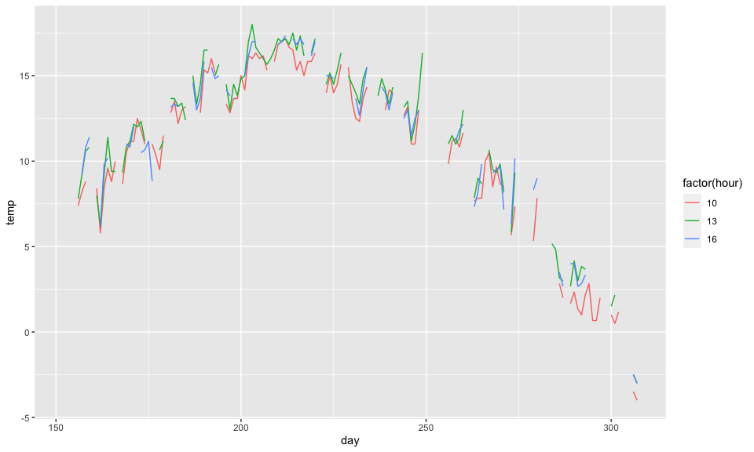
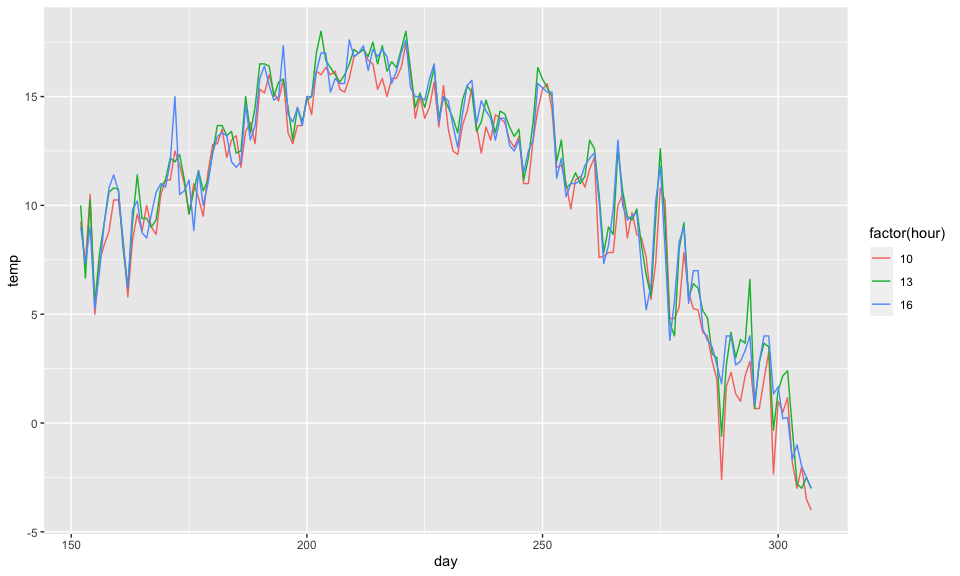
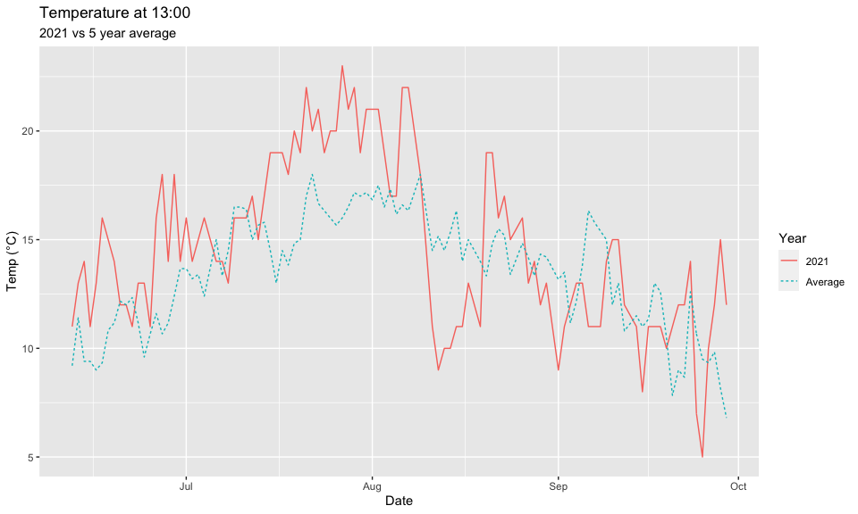
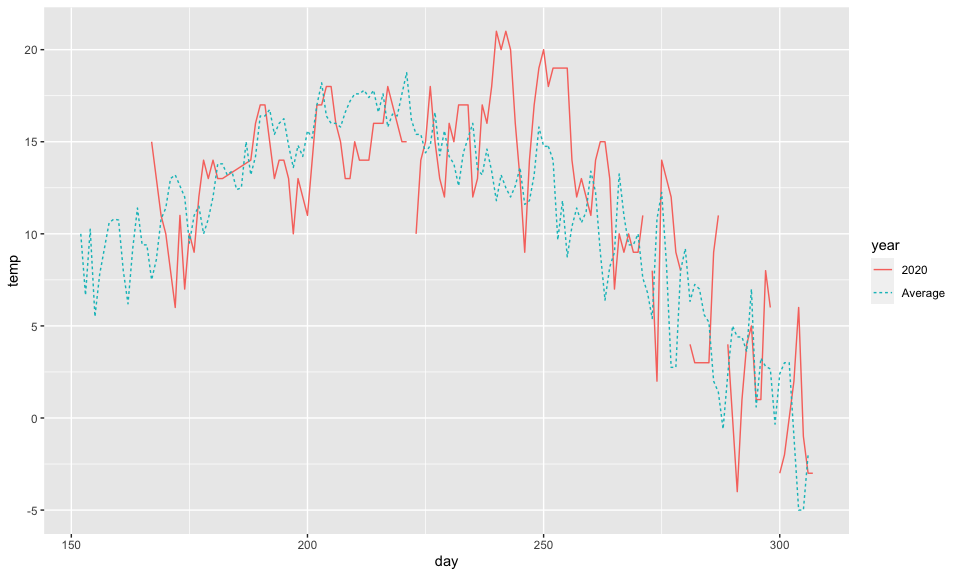

# Average temperatures

There’s two ways we can make a plot comparing the current year to
average years. The first way is quick and easy, but the second way lets
us make an average year dataframe, which we can add to googlesheets or
save as a csv to use again. I’ll show you both.

## Loading the data

First we load the libraries we need.

    library(tidyverse)
    library(lubridate)
    library(googlesheets4)

Next we load the data from google sheets. I won’t save the sheet id on
Github, so you need to run `SHEET_ID <- "<google sheet id>"` in the
console first.

    past_df <- tibble(year = 2015:2020 %>% as.character()) %>% 
      mutate(data = map(year, ~read_sheet(SHEET_ID, .x))) %>% 
      unnest(data) %>% 
      select(date, hour, temp)

This years data is a bit harder to load…

    #' Make sure all the column names are the same. Note: this will break if columns are reordered
    rename_columns <- function (df) {
      colnames(df) <-
        c(
          "timestamp",
          "date",
          "hour",
          "score",
          "temp",
          "snow",
          "wind",
          "weather",
          "visibility",
          "notes"
        )
      return(df)
    }

    #' Convert text to a number
    get_number <- function (x) {
      if (!str_detect(x, "\\d")) {
        # No number characters
        return (NA_real_)
      }
      
      fmtd <- str_remove(x, "[^\\d-\\.]")
      
      return (as.numeric(fmtd))
    }

    kotoshi_df <- read_sheet(SHEET_ID, "2021") %>% 
      rename_columns() %>% 
      select(date, hour, temp) %>% 
      mutate(
        temp = map_dbl(temp, get_number), # Temp has non-numeric input ("--" etc)
      )

## Averaging the data

Now we have two dataframes, this year and the past years. We use the
past years data to calculate the average temperature per day and hour.

    avg_df <- past_df %>% 
      mutate(day = yday(date)) %>% 
      filter(hour == 10 | hour == 13 | hour == 16) %>% # Remove the old times
      group_by(day, hour) %>% 
      summarise(temp = mean(temp), .groups = "drop")

    ggplot(avg_df, aes(day, temp)) +
      geom_line(aes(color = factor(hour)))

    ## Warning: Removed 5 row(s) containing missing values (geom_path).

`mean()` will return `NA` if even one of the values is `NA`. This means
that missing data introduces lots of `NA`’s into our data. There are a
few ways to deal with this but no way is perfect.

While it’s not very statistically good. For the sake of making a quick
graph, the easiest way to deal with this is to tell it to ignore `NA`
values with `mean(x, na.rm = TRUE)`

    avg_df <- past_df %>% 
      mutate(day = yday(date)) %>% 
      filter(hour == 10 | hour == 13 | hour == 16) %>% # Remove the old times
      group_by(day, hour) %>% 
      summarise(temp = mean(temp, na.rm = TRUE), .groups = "drop")

    ggplot(avg_df, aes(day, temp)) +
      geom_line(aes(color = factor(hour)))

## Joining with this years data

Now we have the average temperatures, we just have to connect them to
the data from this year. We do this by joining the two data frames using
the day of the year and hour.

    final_df <- kotoshi_df %>% 
      mutate(day = yday(date)) %>% 
      left_join(avg_df, by = c("day", "hour"), suffix = c("", "_avg"))

I’ll let you work out how to plot it ;-)

## Bonus tricks

If we had all of the data in one dataframe, there is a quicker way to do
this using factors and forcats.

    past_df %>% 
      filter(hour == 13) %>% 
      mutate(
        year = year(date),
        year = factor(year), # Set year to a factor,
        year = fct_other(
          year,
          keep = c("2020"), # If we want to compare 2020 to other years
          other_level = "Average"
        )
      ) %>% 
      mutate(day = yday(date)) %>% 
      group_by(year, day, hour) %>% 
      summarise(temp = mean(temp, na.rm = TRUE), .groups = "drop") %>% # Calculate the mean of the "Average" group
      ggplot(aes(day, temp)) +
      geom_line(aes(linetype = year, color = year))

